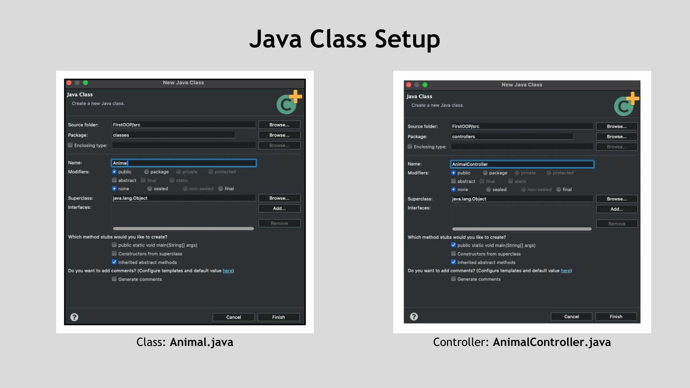

# D4: Intro to Java OOP

<div style="display: flex; justify-content: space-between;">
    <p>Week ２ Session １</p>
    <p>２０２４年０２月１３日（火）</p>
</div>

## Overview

This project serves as an introduction to Java Object-Oriented Programming (OOP) using Spring Tool Suite 4. It covers fundamental concepts of OOP and demonstrates their implementation through a simple Animal OOP project.


## Table of Contents
- [What is Java OOP?](#what-is-java-oop)
    - [Objects and Classes](#objects-and-classes)
- [Getting Started with Spring Tool Suite](#getting-started-with-spring-tool-suite)
- [Creating a Java Project](#creating-a-java-project)
- [Setting Up a Java Class](#setting-up-a-java-class)
    - [Member Variables](#member-variables)
    - [Access Modifiers](#access-modifiers)
    - [Constructors](#constructors)
        - [Method Overloading](#method-overloading)
    - [Getters and Setters](#getters-and-setters)
- [Summary](#summary)


## What is Java OOP?

Java OOP (Object-Oriented Programming) is a programming paradigm that revolves around the concept of "objects," which can contain data and code to manipulate that data. OOP provides several benefits, including modularity, flexibility, scalability, and reusability:

- **Modular (Encapsulation):** Objects encapsulate data and behavior, allowing for better organization and maintenance of code.
- **Flexible (Polymorphism):** Objects can take on different forms and behaviors through polymorphism, enabling dynamic and adaptable code.
- **Scalable (Inheritance):** Classes can inherit attributes and methods from other classes, promoting code reuse and scalability.
- **Reusable (Abstraction):** Abstraction hides complex implementation details, allowing for the reuse of code components.

### Objects and Classes

#### **Classes**
Classes in object-oriented programming serve as blueprints for creating objects. They define the properties (attributes) and behaviors (methods) that objects of the class will have. Acting as templates, classes encapsulate data and functionality related to a specific entity or concept, facilitating code organization and reusability.

#### Objects
Objects are instances of classes, representing individual realizations of the class blueprint. Each object possesses its own unique state, determined by the class attributes, and can perform actions defined by the class methods. Serving as the building blocks of OOP systems, objects allow for modeling real-world entities or abstract concepts in code, enabling data encapsulation and modular code design.

## Getting Started with Spring Tool Suite

To begin working with Java OOP in Spring Tool Suite, follow these steps:

1. Configure workspace settings (upon first time using this software).
2. Navigate to **File > New > Java Project**.
3. Name your Java Project (e.g., FirstOOP).
4. Uncheck Module settings in the bottom section.


## Creating a Java Project

- Navigate to the **src** directory, where all project files will reside.
- Create two packages: `classes` and `controllers`, following lowercase/camelCase naming conventions.
- Create your first class, named **Animal**, within the **classes** package.
    - NOTE: Class names follow the PascalCase naming conventions and remain singular.
- Similarly, create an **AnimalController** within the **controllers** package.

<div align="center">

</div>


## Setting Up a Java Class

### Member Variables

Member variables, also called class attributes, are data fields within a Java class that define the properties or state of objects created from that class. They hold unique values for each instance of the class and are accessible throughout the class. Member variables encapsulate object data and facilitate state manipulation through getter and setter methods. In a Java Spring project, they represent domain object properties and store data for application components.

Class: **Animal.java**
```java
private String color;
private double height;
private int weight;
private String name;
```

### Access Modifiers

Access modifiers in Java are keywords that specify the accessibility of classes, methods, and attributes within a program. They control which parts of the code can access and interact with certain elements. Access modifiers are used to enforce encapsulation, which is a key principle of object-oriented programming, by restricting access to sensitive data and internal implementation details.

1. **Public Access Modifier:**
   - The `public` access modifier allows unrestricted access to the class, method, or attribute from any other part of the program. In a Java Spring project, public access modifiers are commonly used for controller classes and methods that need to be accessible from external components, such as HTTP requests or other parts of the application.

2. **Protected Access Modifier:**
   - The `protected` access modifier limits access to the class member within its own package and by subclasses, enabling subclasses to access and manipulate inherited members. In a Java Spring project, protected access modifiers may be used for certain methods or attributes that need to be accessible within a specific package or by subclasses.

3. **Private Access Modifier:**
   - The `private` access modifier restricts access to the class member to only within its own class, preventing external access or manipulation. It ensures data encapsulation by hiding implementation details and sensitive data from other parts of the program. In a Java Spring project, private access modifiers are commonly used for class attributes or methods that should not be accessible outside of their defining class, helping to maintain code integrity and security.


| Modifier  | Class | Package | Subclass | Global |
|:---------:|:-----:|:-------:|:--------:|:------:|
| Public    | ✓     | ✓       | ✓        | ✓      |
| Protected | ✓     | ✓       | ✓        | ×      |
| Private   | ✓     | ×       | ×        | ×      |


### Constructors

Constructors in Java are special methods within a class used for initializing objects. They have the same name as the class and are invoked when an object of that class is created using the `new` keyword. Constructors initialize the state of an object by setting initial values to its member variables or performing other initialization tasks. They can have parameters to receive values that are used during object creation. Constructors play a crucial role in ensuring that objects are properly initialized before they are used in the program. In a Java Spring project, constructors are commonly used to create instances of domain objects and set their initial state, ensuring that objects are ready for use within the application.

Class: **Animal.java**
```java
package classes;

public class Animal {
    // Member Variables removed for brevity...
    // Constructors
    public Animal() {
        this.color = "default color";
        this.height = 0.0;
        this.weight = 0;
        this.name = "default name";
    }
    
    public Animal(String color, double height, int weight, String name) {
        this.color = color;
        this.height = height;
        this.weight = weight;
        this.name = name;
    }
}
```

Controller: **AnimalController.java**
```java
package controllers;

import classes.Animal;

public class AnimalController {

    public static void main(String[] args) {
        // Instantiate a new Animal Object
        Animal animalOne = new Animal();
    }
}
```

#### Method Overloading

The default constructor `public Animal()` provides a way to create an Animal object without specifying any initial attributes. It initializes the attributes to default values, ensuring that an Animal object can be created even when specific attribute values are not provided during instantiation.

On the other hand, the parameterized constructor `public Animal(String color, double height, int weight, String name)` allows for the creation of Animal objects with specific attribute values provided by the caller. This constructor allows customization of the initial state of the object, enabling the creation of Animal objects with different attribute values based on the requirements of the application.

By providing both a default constructor and a parameterized constructor, the Animal class accommodates different scenarios where objects may need to be created with either default attribute values or specific attribute values as per the caller's needs. This enhances the versatility and usability of the Animal class within the application.


### Getters and Setters

<div align="center">

<figcaption>Accessed by right-clicking a space in the IDE > Source > Generate Getters and Setters</figcaption>
</div>

Getters and setters are used to retrieve and modify class attributes, respectively. It's better to use them rather than accessing class attributes directly, as they provide encapsulation and enable better control over attribute access.

Class: **Animal.java**
```java
package classes;

public class Animal {
    
    // Member Variables
    private String color;
    private double height;
    private int weight;
    private String name;
    
    // Constructors removed for brevity...
    
    // Getters & Setters
    public String getColor() {
        return color;
    }

    public void setColor(String color) {
        this.color = color;
    }

    public double getHeight() {
        return height;
    }

    public void setHeight(double height) {
        this.height = height;
    }

    public int getWeight() {
        return weight;
    }

    public void setWeight(int weight) {
        this.weight = weight;
    }

    public String getName() {
        return name;
    }

    public void setName(String name) {
        this.name = name;
    }
}
```

Controller: **AnimalController.java**
```java
package controllers;

import classes.Animal;

public class AnimalController {

    public static void main(String[] args) {
        
        Animal animalOne = new Animal();
        System.out.println(animalOne.getColor()); // >> default color
        
        animalOne.setColor("tri-colored");
        System.out.println(animalOne.getColor()); // >> tri-colored
    }
}
```


## Summary
This README provides a comprehensive overview of Java OOP concepts and demonstrates their application in the Animal OOP project using Spring Tool Suite 4.