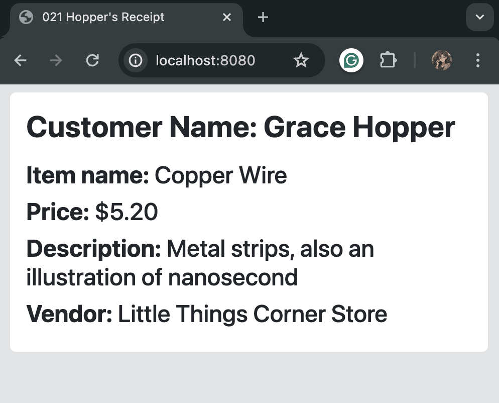

# 021 Hopper's Receipt

## Overview

**Hopper's Receipt** is a Java Spring MVC project designed to learn how to render views using JSP files and incorporate JSTL tags for data presentation and formatting. The project emulates a receipt generation system, displaying various purchase details on a web page.

_**Note**: For how to set up the configurations to render data from the back-end to the front-end, go [here](../notes/Setting_up_views_in_Java_Spring.md)._

<div align="center">

</div>


## Key Concepts

### Model in Java Spring MVC

In Java Spring MVC, the Model represents the data intended for display on a web page. It typically consists of Java objects containing the necessary data. In this project, the `MainController` class handles the data population:

```java
@RequestMapping("/")
public String index(Model model) {
    // Data to be displayed on the web page
    String customerName = "Grace Hopper";
    String itemName = "Copper Wire";
    double itemPrice = 5.20;
    String description = "Metal strips, also an illustration of nanosecond";
    String vendor = "Little Things Corner Store";
    
    // Adding data to the Model
    model.addAttribute("customer", customerName);
    model.addAttribute("item", itemName);
    model.addAttribute("price", itemPrice);
    model.addAttribute("desc", description);
    model.addAttribute("vendor", vendor);
    
    // Returning the view name
    return "index.jsp";
}
```

### Rendering Data Using JSTL Tags

#### `<c:out>` Tag

The `<c:out>` tag is utilized to display the value of an expression. It's commonly employed to present data from the model in JSP files:

```jsp
<h1>Customer Name: <c:out value="${customer}" /></h1>
```

This line demonstrates how the customer's name, fetched from the model, is displayed on the web page.

#### `<fmt:formatNumber>` Tag

The `<fmt:formatNumber>` tag is employed to format numeric values, such as currency, dates, and percentages. In this project, it's used to format the price to two decimal places:

```jsp
<fmt:formatNumber value="${price}" type="currency" minFractionDigits="2" maxFractionDigits="2" />
```

This line formats the price value fetched from the model as currency with two decimal places.


---
<p align="right">Completed: ２０２４年０４月１４日（日）</p>