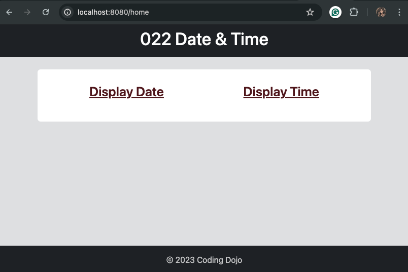
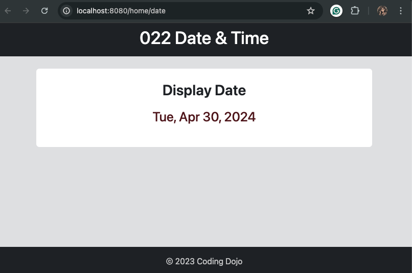
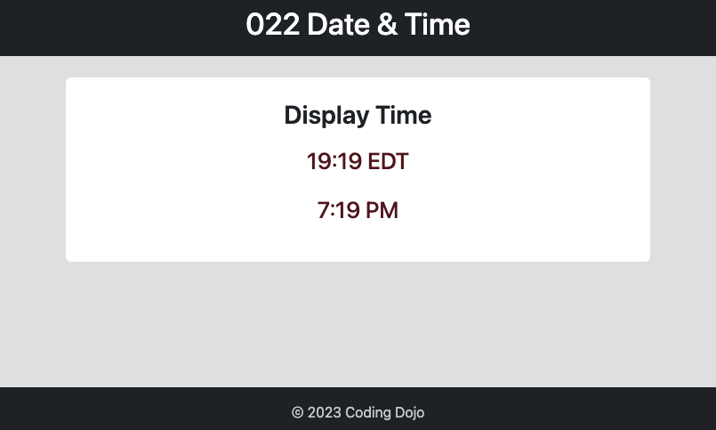

# 022 Display Date

This project is a simple web application built using Java Spring Boot to display the current date and time. It consists of three main components: a Spring MVC controller, JSP (JavaServer Pages) files for the views, and a static CSS file for styling.

## Overview

The goal of this project is to create a web application that allows users to view the current date and time by navigating to different pages within the application. The application has three main pages: the home page (`index.jsp`), the date page (`date.jsp`), and the time page (`time.jsp`). Each page displays either the current date or time, depending on the user's selection.

## Components

### 1. MainController.java

The `MainController` class is a Spring MVC controller responsible for handling requests and rendering views. It contains three request mapping methods:

- `home()`: Maps to the root URL ("/home") and returns the `index.jsp` view.
- `displayDate()`: Maps to the "/home/date" URL and retrieves the current date, formats it, and passes it to the `date.jsp` view.
- `displayTime()`: Maps to the "/home/time" URL and retrieves the current time (in both military and standard formats), formats it, and passes it to the `time.jsp` view.

### 2. JSP Files

- `index.jsp`: This is the home page of the application. It contains links to navigate to the date and time pages.

- `date.jsp`: This page displays the current date retrieved from the controller.

- `time.jsp`: This page displays the current time (both military and standard formats) retrieved from the controller.

### 3. Static Resources

- `index.css`: This is a static CSS file used to style the HTML elements in the JSP files.

## Logic

The logic used to achieve the goal of displaying the date and time correctly involves:

1. Creating a Spring MVC controller (`MainController`) to handle requests and retrieve the current date and time.
2. Defining request mapping methods in the controller to map to different URLs ("/home", "/home/date", "/home/time").
3. Formatting the current date and time using `SimpleDateFormat`.
4. Passing the formatted date and time as model attributes to the corresponding JSP views (`date.jsp` and `time.jsp`).
5. Including header and footer partials in each JSP file to maintain a consistent layout across pages.

## Technologies Used

- Java Spring Boot
- JSP (JavaServer Pages)
- HTML
- CSS (Bootstrap)

## Getting Started

To run the application locally:

1. Clone this repository to your local machine.
2. Open your preferred Java IDE (Integrated Development Environment), such as IntelliJ IDEA or Eclipse.
3. Import the project into your IDE by selecting the option to import a Maven project.
4. Once the project is imported, navigate to the project directory in the IDE's file explorer.
5. Right-click on the project folder and select the option to run as a Spring Boot App.
6. Alternatively, you can run the application from the command line by navigating to the project directory and running the command `mvn spring-boot:run`.
7. Open your web browser and go to http://localhost:8080/home to view the application.

---

Completed: ２０２４年０４月３０日（火）
