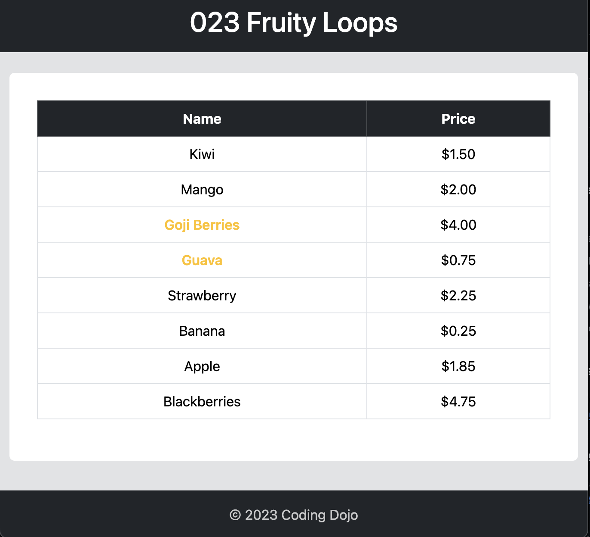

# 023 Fruity Loops

**Fruity Loops** is a Java Spring Boot MVC project aimed at practicing dynamic rendering of lists in templates using the `c:forEach` JSTL tag and incorporating models. The project showcases a simple fruit store scenario where a list of fruits with their prices is rendered dynamically on the view.

## Dependencies

The following dependencies are implemented in the project to enable rendering of models on views:

```xml
<!-- Backend Setup -->
<dependency>
    <groupId>org.apache.tomcat.embed</groupId>
    <artifactId>tomcat-embed-jasper</artifactId>
</dependency>
<dependency>
    <groupId>jakarta.servlet.jsp.jstl</groupId>
    <artifactId>jakarta.servlet.jsp.jstl-api</artifactId>
</dependency>
<dependency>
    <groupId>org.glassfish.web</groupId>
    <artifactId>jakarta.servlet.jsp.jstl</artifactId>
</dependency>
```

### Application Properties

Additionally, the following properties are configured in `application.properties`:

```
spring.application.name=023-FruityLoops
spring.mvc.view.prefix=/WEB-INF/
```

## Rendering Logic

The logic used to render the table in the view (`index.jsp`) is as follows:

1. The controller (`ItemController.java`) populates a list of `Item` objects representing fruits.
2. The list of `Item` objects is added to the model as an attribute named "fruits".
3. In the JSP view (`index.jsp`), the `c:forEach` JSTL tag is used to iterate over each fruit in the "fruits" attribute.
4. For each fruit, a table row (`<tr>`) is generated with two columns: Name and Price.
5. If the name of the fruit starts with the letter "G", the name is rendered in orange color using conditional logic within the JSTL tag.
6. The price of each fruit is formatted using the `<fmt:formatNumber>` tag to display it with two decimal places.
7. The final HTML table is rendered with the list of fruits dynamically generated based on the data provided by the controller.

<div align="center">

</div>

---
<p align="right">Completed: ２０２４年０５月０２日（木）</p>