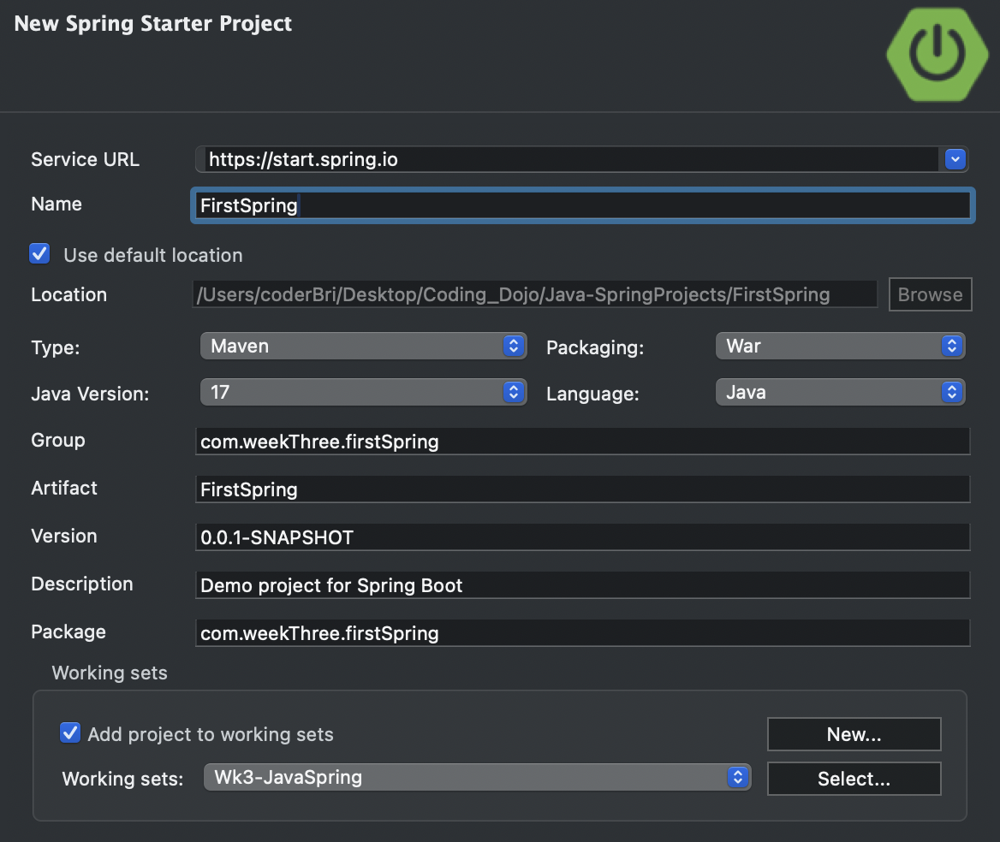
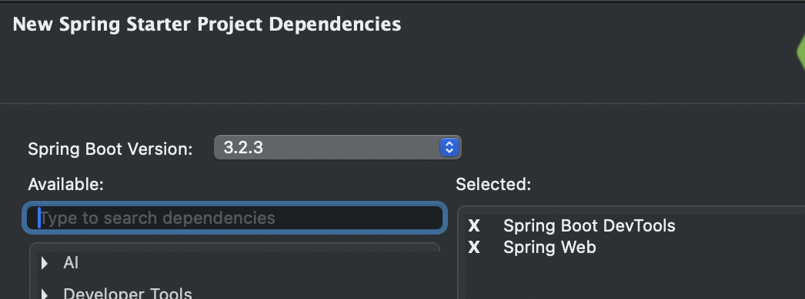
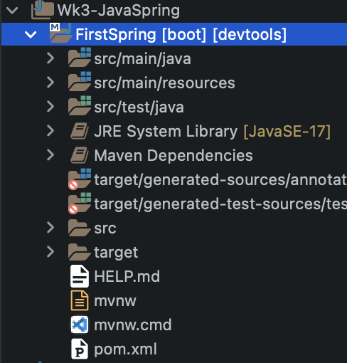
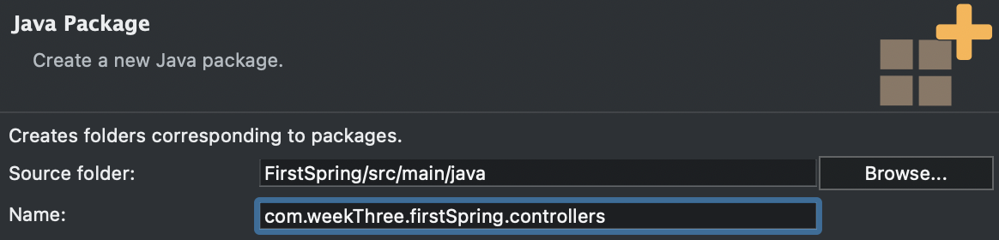

# D7: Intro to Java Spring

<div style="display: flex; justify-content: space-between;">
    <p>Week ３ Session １</p>
    <p>２０２４年０３月０７日（木）</p>
</div>


### Table of Contents
- Starting a Java Spring Project
- Configuring Files

## Starting a Java Spring Project
1. **New > Spring Starter Project:**
   - Begin by creating a new Spring Starter Project in your IDE.
   
2. **The setup is as follows:**
   - Set up your project with the necessary dependencies and configurations. 
   <div align="center">
    
    </div>
    
3. **Click Next.**
4. **Select the following dependencies:**
   - **Spring Boot DevTools**
   - **Spring Web**
   <div align="center">
    
    </div>
    
5. **Click Finish.**
   - After a short while, the new Java Spring project will be generated.
   <div align="center">
    
    </div>

## Configuring Files
1. **Now we can start by creating our controller by accessing the directory labeled `src/main/java`, and create a package called `controllers`. However, the naming convention is now as follows:**
   - This is known as reverse domain naming. This is the standard to avoid conflicting naming conventions. It should also be all lowercase.
   <div align="center">
    
    </div>

6. **Create controller class as usual within the controllers package.**


## Setting up the Controller.
1. Add the **`@RestController`** annotation on top of the class name. Import it with shortcut Command ⌘ + Shift ⇧ + O:
    ```java
    import org.springframework.web.bind.annotation.RestController;
            
    @RestController
    public class MainController {}
    ```

2. Now create the first route using the **`@RequestMapping`** annotation:
    ```java
    @RequestMapping("/")
	public String index() {
		return "Hello World";
	}
    ```
    For better modularity of routes, this root route can be in the [ProjectName]Application.java file. Directory path: **src/main/java/com.weekThree.firstSpring**(package)**/FirstSpringApplication.java**:
    ```java
    import org.springframework.boot.SpringApplication;
    import org.springframework.boot.autoconfigure.SpringBootApplication;
    import org.springframework.web.bind.annotation.RequestMapping;
    import org.springframework.web.bind.annotation.RestController;
    
    @RestController
    @SpringBootApplication
    public class FirstSpringApplication {
        public static void main(String[] args) {
            SpringApplication.run(FirstSpringApplication.class, args);
        }
        
        @RequestMapping("/")
        public String index() {
            return "Hello World!";
        }
        
    }
    ```
    That way, this will better serve as the entry point of the application.

3. To use Path Variables use the annotation **`@PathVariable`** within the function as well as the data type and variable holding that data.
    ```java
    // localhost:8080/hello/jane
	@RequestMapping("/hello/{name}")
	public String hello( @PathVariable("name") String name) {
		return "<h1>你好，" + name +"。</h1>";
	}

4. The **`@RequestParam`** annotation is used to extract query parameters from the request URL. In this example, it retrieves the values of `firstName` and `lastName` query parameters and returns a customized greeting message based on the provided parameters. An if-else statement is used to handle cases where one or both parameters are not provided.
    ```java
	// localhost:8080/hello?firstName=Jane&lastName=Doe
	@RequestMapping("/hello")
	public String helloName(
			@RequestParam(value="firstName", required=false) String fname,
			@RequestParam(value="lastName", required=false) String lname
			) {
		if (fname == null && lname == null) {
			return "<h3>Hello...</h3>";
		} else if (lname == null) {
			return String.format("<h2>Hello, %s.</h2>", fname);
		} else if (fname == null) {
			return String.format("<h2>Hello, %s.</h2>", lname);
		} else {
			return String.format("<h1>Hello, %s %s.</h1>", fname, lname);
		}
	}
    ```
    *This also is useful for GET requests because it allows you to extract data from the request URL.

