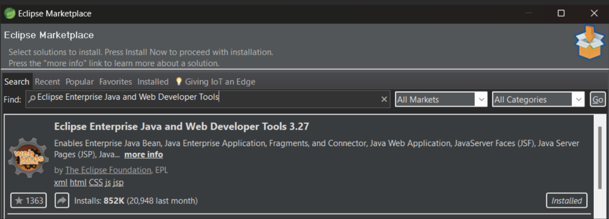
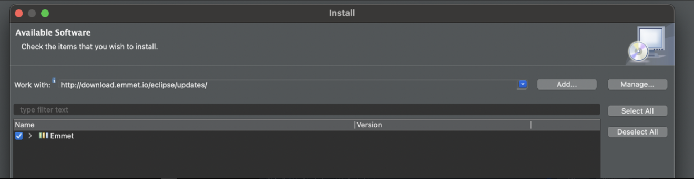

# 1 Rendering JSP

1. To add views in a Java Spring project we need to start by installing the Web developer tools. From the help menu, search the Eclipse Marketplace for **"Eclipse Enterprise Java and Web Developer Tools"** and click Install. You may need to restart STS after the installation.


<div align="center">
   
</div>

<div align="center">
   
</div>


2. Once installed, the following dependencies need to be added in the [**pom.xml**](./FirstSpring/pom.xml) file to support Java Server Pages (JSPs):
   ```xml
   <dependencies>
       <!-- other dependencies removed for brevity -->
       <dependency>
           <groupId>org.apache.tomcat.embed</groupId>
           <artifactId>tomcat-embed-jasper</artifactId>
       </dependency>
   </dependencies>
   ```


3. Now JSP files can be created. In the following directory: `src/main/webapp` a folder called **`WEB-INF/`** will need to be created. In a Java Spring project, the `WEB-INF` folder is used to securely store configuration files and JavaServer Pages (JSPs), ensuring they're not directly accessible from the web.

<div align="center">
   
</div>


4. Then in the [**`application.properties`**](./FirstSpring/src/main/resources/application.properties) file, the following is needed to enable dynamic rendering:
   ```
   spring.mvc.view.prefix=/WEB-INF/
   ```


5. When rendering JSP files, the `@Controller` annotation will be used for our class instead of the `@RestController` annotation. This will tell Spring Boot that we intend to use this controller to serve up _**views**_ and not just raw data.
```java
package com.codingdojo.controllerspractice.controllers;
import org.springframework.stereotype.Controller;
import org.springframework.web.bind.annotation.RequestMapping;

@Controller
public class FruitController {
   
	@RequestMapping("/")
	public String index() {
			return "index.jsp";
	}
   
}
```

   _**Note**: To automatically import annotations or data types, use the shortcut: **Cmd ⌘ + Shift ⇧ + O**._
   
   _**Note**: To learn about rendering data, go [here](./2-About-JSTL-Tags.md)._

## How to get the option to create a **New → JSP File**?

5. Right-click on the project and run it as a Spring Boot App as before. Once the server restarts, the JSP file will be displayed in the browser at its URL: [http://localhost:8080/[url-path-name]](#).

<div align="center">
   
</div>

<div align="center">
   
</div>

s
## Resolving a Common Error Within JSP Files

To resolve this error that tends to appear on a JSP File do the following:

<div align="center">
   
</div>

Right-click on the project, select '**Properties**', and under '**Project Facets**' → '**Dynamic Web Module**', select 5.0 from the dropdown menu and apply the changes. You may need to close the JSP, reopen it, or make a change in the JSP and save it for the changes to take effect.

<div align="center">
   
</div>


## Installing the Emmet Tool

Emmet is a plugin for HTML, XML, XSL (or any other structured code format) coding and editing that will help with highlighting and syntax for JSP Files.

1. Inside Spring Tool Suite, go to ‘**Help‘ → ‘Install New Software’.** In the WorkWith box, enter `http://download.emmet.io/eclipse/updates/` and select **Emmet** from the download menu.
  
   *NOTE: You may need to click 'Add..', type in 'Emmet' under name, and click 'Add' for it to appear.*

<div align="center">
   
</div>


2. Inside STS in the main menu, go to **Preferences**, located in the Spring Tool Suite tab or the **Window** tab depending on your OS. Then search for "Emmet", and add "jsp" to the list of associated files. Be sure to apply your changes. STS may need to restart for the changes to take effect.

<div align="center">
   
</div>
