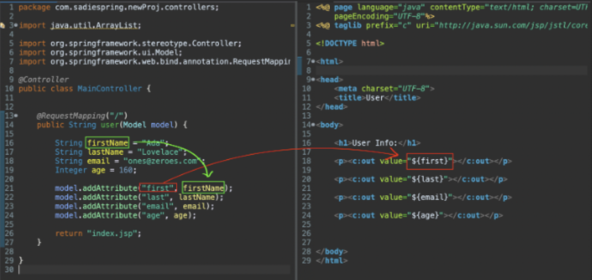

# 2 About JSTL Tags

JSTL, or the Java Server Pages Standard Tag Library, are used to dynamically populate templates with data from the server, specifically from the controller.

## Setup

1. The following dependencies need to be added to the **[pom.xml](../FirstSpring/pom.xml)**.
    ```xml
    <dependencies>
        <!-- Dependencies to support JSTL usage -->
        <dependency>
            <groupId>jakarta.servlet.jsp.jstl</groupId>
            <artifactId>jakarta.servlet.jsp.jstl-api</artifactId>
        </dependency>
        <dependency>
            <groupId>org.glassfish.web</groupId>
            <artifactId>jakarta.servlet.jsp.jstl</artifactId>
        </dependency>
    </dependencies>
    ```


2. Whenever we need to use JSTL in a JSP file, they will be added to the top:
    ```jsp
    <%@ page language="java" contentType="text/html; charset=UTF-8" pageEncoding="UTF-8"%>
    <!-- New line below to use the JSP Standard Tag Library -->
    <%@ taglib prefix="c" uri="http://java.sun.com/jsp/jstl/core" %>
    ```
    _**NOTE** To comment out JSTL syntax, use the shortcut: **Cmd ⌘ + Shift ⇧ + C**._


### Using the `c:out` Tag

The <c:out /> tag is used to insert values to display in the body of the HTML code. It enables us to do something like the following:
```jsp
<h1>Two plus two is: </h1>
<h2><c:out value="${2+2}"/></h2>
```

Which will render the following:
<div align="center">
   ` tag" width="350px" height="auto">
</div>


## View Model

To pass data to our view we can inject a Model object to our controller method. This model object implements the map interface and exposes the key-value pairs in our view.

```java
package com.codingdojo.controllerspractice.controllers;
import org.springframework.web.bind.annotation.RequestMapping;
import org.springframework.stereotype.Controller;
// New import needed!
import org.springframework.ui.Model;

@Controller
@RequestMapping("/view")
public class HomeController {
    
    // localhost:8080/view
    @RequestMapping("")
    public String index( Model model ) {
        //       keyword to pass, value to display
        model.addAttribute("cat", "猫 māo");
        return "index.jsp";
    }
}
```

Then the object will be called in our view:
```html
<%@ page language="java" contentType="text/html; charset=UTF-8" pageEncoding="UTF-8"%>
<%@ taglib prefix="c" uri="http://java.sun.com/jsp/jstl/core"%>
<!DOCTYPE html>
<html lang="en">
	<head>
	    <meta charset="UTF-8" />
	    <title>Index Page</title>
	</head>
	<body>
	    <p>
	        <c:out value="${cat}"/>
	    </p>
	</body>
</html>
```

### Dependency Injection

In Spring MVC, whenever you import Model into your controller you can use it as a container to store data and pass that data to the view engine. Data can be any type: objects, strings, numbers, even dates! And you can use it in any of your method signatures. When the framework gets a request mapped to that function, it will automatically create that Model instance container, the model variable in our code below. This is an example of dependency injection.

<div align="center">
   
</div>

## More on JSTL Capabilities

JSTL tags can support all kinds of objects and other data, such as lists, as well as being able to loop over those lists.

1. For example, in your controller the following data is prepared:
    ```java
    @GetMapping("/loop-example")
    public String viewLoop( Model viewModel ) {
        ArrayList<String> pets = new ArrayList<String>();
        pets.add("cats");
        pets.add("dogs");
        pets.add("bunnies");
        pets.add("goldfish");
        pets.add("parrots");
        viewModel.addAttribute("allPets", pets);
        return "demo.jsp";
    }
    ```

2. Then in the JSP File, to display each of the pets from the list, the `forEach` JSTL tag will be used to loop over them:
    ```html
    <%@ page language="java" contentType="text/html; charset=UTF-8"
        pageEncoding="UTF-8"%>
    <%@ taglib prefix="c" uri="http://java.sun.com/jsp/jstl/core"%>
    <!DOCTYPE html>
    <html>
        <head>
            <meta charset="UTF-8">
            <link href="https://cdn.jsdelivr.net/npm/bootstrap@5.3.3/dist/css/bootstrap.min.css" rel="stylesheet" integrity="sha384-QWTKZyjpPEjISv5WaRU9OFeRpok6YctnYmDr5pNlyT2bRjXh0JMhjY6hW+ALEwIH" crossorigin="anonymous">
            <title>D8: First Spring View - Loop Ex.</title>
        </head>
        <body>
            
            <div class="container-fluid">		
                <h1 class="fw-semibold">JSTL Loop Example</h1>
                <h2>Pets</h2>
                
                <c:forEach var="onePet" items="${allPets}">
                    <c:if test="${onePet.equals('cats')}">
                    <h3 class="fw-bolder">cats <- the best animal</h3>
                    </c:if>
                    
                    <h3><c:out value="${onePet}"/></h3>
                    
                </c:forEach>
            </div>
        </body>
    </html>
    ```

3. Similarly, if we have a collection type, say a List of Person objects, we could also use the `forEach` tag:
    
    ```html
    <c:forEach var="person" items="${people}">
        <c:out value="${person.name}"/>
    </c:forEach>
    ```
    
    This will iterate over the `people` attribute passed from our controller and set each iteration to the local variable of `person` that we declared here. This will then be written into the html delivered in the http response.
    
    _**Note:** It's worth reiterating that the `person` in the above example does *not* need `${}` around it when it is declared. The `var` attribute here is an iterator. Much like `i` in our previous loops, we use a string literal here to declare the variable name. To drive the point home, we could also have done the following, assuming that `people`, a model attribute, is a List of Person objects, `List<Person>` from our controller._
    