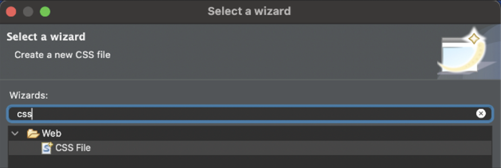
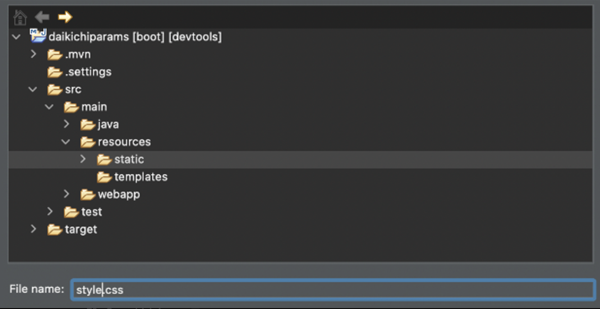
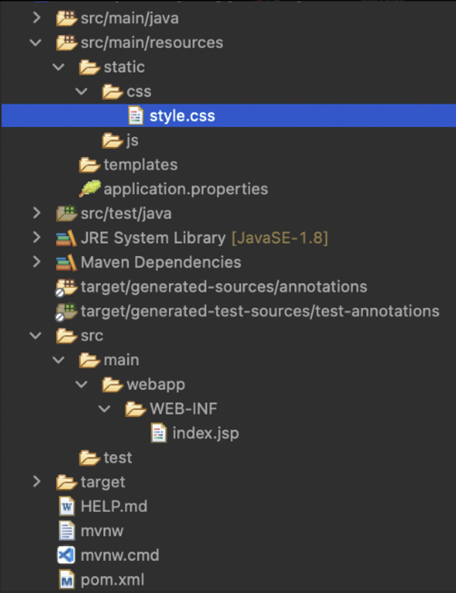

# 3 Adding Static Content + Bootstrap

Spring Boot automatically looks inside the ***static*** folder located at `src/main/**resources**`. This folder is where we will put our static CSS and JavaScript files. For file organization, we will create a css folder, and a js folder. For this course, all of our web pages will dynamically render data from the server side using `.jsp` files, so we will store any files we want rendered in the **`WEB-INF`** folder rather than in the static folder.

1. Create a new CSS file by going to new → other → then search for "css"

    <div align="center">
    
    </div>

2. All static files will be stored in the `src/main/resources/`**`static`** path. For better modularity, a dedicated **`css`** and **`js`** folder can be created:

    <div align="center">
    
    </div>
    <div align="center">
    
    </div>

3. Add the link tag in the JSP file to any external resources, just as it would be done in an HTML file.
    - `src/main/webapp/`**`WEB-INF/index.jsp`**
        ```html
        <%@ page language="java" contentType="text/html; charset=UTF-8" pageEncoding="UTF-8"%>
        <!DOCTYPE html>
        <html>
            <head>
                <title>hello world</title>
                <link rel="stylesheet" type="text/css" href="/css/style.css">
                <script type="text/javascript" src="/js/app.js"></script>
            </head>
            <body>
                <h1>Hello world, with some style!</h1>
            </body>
        </html>
        ```
    
    - `src/main/resources/static/`**`css/style.css`**
        ```css
        h1 {
            color: blue;
        }
        ```
    
    - `src/main/resources/static/`**`js/app.js`**
        ```js
        alert("Hello World");
        ```
    

## Bootstrap

1. In [`pom.xml`](../FirstSpring/pom.xml), add the following dependencies:
    ```xml
    <dependency>
        <groupId>org.webjars</groupId>
        <artifactId>webjars-locator</artifactId>
        <version>0.46</version>
    </dependency>

    <!-- BOOTSTRAP DEPENDENCIES -->
    <dependency>
        <groupId>org.webjars</groupId>
        <artifactId>bootstrap</artifactId>
        <version>5.2.3</version>
    </dependency>
    ```
    *NOTE: The webjars-locator dependency enables auto-detection of the version, which means that your `.jsp` file links will be version-agnostic in case you update the versions here in your `pom.xml`*
    
    
2. Inside the head section of any JSP you want to add Bootstrap styling to:
    
    ```html
    <!-- for Bootstrap CSS -->
    <link rel="stylesheet" href="/webjars/bootstrap/css/bootstrap.min.css" />
    <!-- YOUR own local CSS -->
    <link rel="stylesheet" href="/css/main.css"/>
    <!-- For any Bootstrap that uses JS -->
    <script src="/webjars/bootstrap/js/bootstrap.min.js"></script>
    ```
    *This is not up to date and requires the most recent version that’s listed in the official site.*