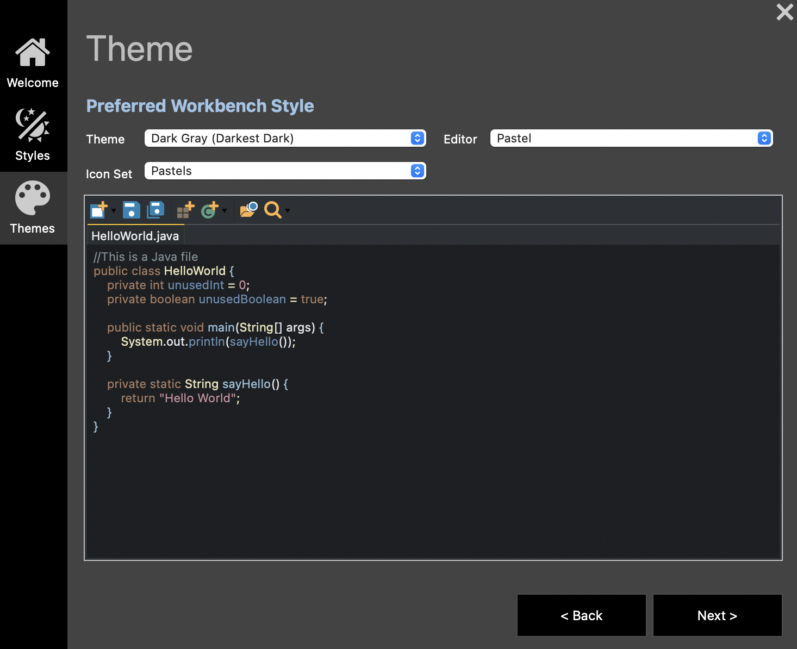

# Spring Extensions I Use

To install extensions go to **Help** > **Exclipse Marketplace**.

### Darkest Dark Theme with DevStyle

### Eclipse Web Developer Tools
### Eclipse XML Editors and Tools 3.27